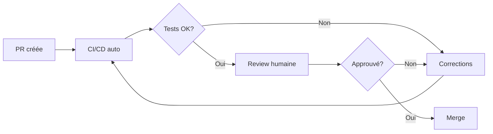

# 🤝 Guide de Contribution - Patrimoine Immo

Merci de votre intérêt pour contribuer à Patrimoine Immo ! Ce guide vous aidera à démarrer.

## 📋 Table des matières

- [Code of Conduct](#-code-of-conduct)
- [Comment contribuer](#-comment-contribuer)
- [Setup environnement](#-setup-environnement)
- [Standards de code](#-standards-de-code)
- [Workflow Git](#-workflow-git)
- [Tests](#-tests)
- [Pull Requests](#-pull-requests)
- [Ressources](#-ressources)

---

## 📜 Code of Conduct

### Nos engagements

- ✅ Respect et bienveillance envers tous les contributeurs
- ✅ Feedback constructif et professionnel
- ✅ Focus sur le meilleur pour le projet et la communauté
- ✅ Accueil des nouveaux contributeurs

### Comportements inacceptables

- ❌ Harcèlement sous toute forme
- ❌ Discrimination
- ❌ Trolling ou commentaires insultants
- ❌ Publication d'informations privées

---

## 🚀 Comment contribuer

### Types de contributions acceptées

| Type | Description | Label GitHub |
|------|-------------|--------------|
| 🐛 **Bug fixes** | Corrections de bugs | `bug` |
| ✨ **Features** | Nouvelles fonctionnalités | `enhancement` |
| 📚 **Documentation** | Améliorations de la doc | `documentation` |
| 🧪 **Tests** | Ajout/amélioration de tests | `test` |
| ♻️ **Refactoring** | Optimisations du code | `refactor` |
| 🎨 **UI/UX** | Améliorations visuelles | `ui` |
| ⚡ **Performance** | Optimisations de performance | `performance` |

### Avant de commencer

1. **Vérifiez les issues existantes** pour éviter les doublons
2. **Créez une issue** pour discuter des changements majeurs
3. **Lisez la documentation** :
   - [README.md](README.md) - Vue d'ensemble
   - [RAPPORT_PATRIMO.md](RAPPORT_PATRIMO.md) - Architecture
   - [API.md](API.md) - Documentation API
   - [TESTING.md](TESTING.md) - Guide des tests

---

## 🛠️ Setup environnement

### Prérequis

- **Node.js** 20+ ([télécharger](https://nodejs.org/))
- **npm** 10+ (inclus avec Node.js)
- **Git** ([télécharger](https://git-scm.com/))
- **VS Code** recommandé ([télécharger](https://code.visualstudio.com/))

### Extensions VS Code recommandées

```json
{
  "recommendations": [
    "dbaeumer.vscode-eslint",
    "esbenp.prettier-vscode",
    "bradlc.vscode-tailwindcss",
    "Prisma.prisma",
    "ms-vscode.vscode-typescript-next"
  ]
}
```

### Installation

```bash
# 1. Fork le repo sur GitHub (bouton "Fork")

# 2. Clone votre fork
git clone https://github.com/VOTRE-USERNAME/patrimoine-immo.git
cd patrimoine-immo

# 3. Ajoutez le repo original comme remote
git remote add upstream https://github.com/timaelia1-mgt/patrimoine-immo.git

# 4. Installez les dépendances
npm install

# 5. Copiez les variables d'environnement
cp .env.example .env.local
# Éditez .env.local avec vos clés Supabase

# 6. Lancez le serveur de dev
npm run dev
```

### Vérifier l'installation

```bash
# Vérifier que tout fonctionne
npm run lint     # Pas d'erreurs
npm run test     # Tests passent
npm run build    # Build réussi
```

---

## 💻 Standards de code

### TypeScript

```typescript
// ✅ BON - Types explicites et stricts
interface BienData {
  nom: string
  prixAchat: number
  loyerMensuel: number
}

async function createBien(data: BienData): Promise<Bien> {
  // Validation
  if (!data.nom) {
    throw new Error('Nom requis')
  }
  // ...
}

// ❌ MAUVAIS - Types any, pas de validation
function createBien(data: any): any {
  return data
}
```

### Naming conventions

```typescript
// Variables & fonctions : camelCase
const userName = "John"
const isLoading = true
function calculateRentability() {}
async function fetchUserProfile() {}

// Classes & Interfaces : PascalCase
class BienService {}
interface UserProfile {}
type BienType = 'appartement' | 'maison'

// Constantes globales : UPPER_SNAKE_CASE
const MAX_BIENS_GRATUIT = 2
const API_BASE_URL = "https://..."
const DEFAULT_CURRENCY = "EUR"

// Fichiers composants React : PascalCase.tsx
// BienCard.tsx, DashboardClient.tsx, QuittanceDialog.tsx

// Fichiers utilitaires : camelCase.ts ou kebab-case.ts
// database.ts, calculations.ts, format-currency.ts

// Fichiers de test : *.test.ts ou *.test.tsx
// calculations.test.ts, BienCard.test.tsx
```

### Structure de fichiers

```
patrimoine-immo/
├── app/                        # Routes Next.js (App Router)
│   ├── (protected)/           # Routes protégées (auth)
│   │   ├── dashboard/
│   │   │   └── page.tsx       # /dashboard
│   │   └── biens/[id]/
│   │       └── page.tsx       # /biens/:id
│   ├── api/                   # Routes API
│   │   ├── auth/
│   │   ├── biens/
│   │   └── export/
│   └── layout.tsx             # Layout racine
├── components/                 # Composants React réutilisables
│   ├── ui/                    # Composants UI (shadcn)
│   ├── biens/                 # Composants liés aux biens
│   ├── dashboard/             # Composants dashboard
│   └── layout/                # Layout (Sidebar, Header)
├── lib/                       # Utilitaires et logique métier
│   ├── database.ts            # Fonctions CRUD Supabase
│   ├── calculations.ts        # Calculs financiers
│   ├── validations.ts         # Validations
│   └── supabase/              # Configuration Supabase
├── __tests__/                 # Tests
│   ├── lib/                   # Tests unitaires
│   ├── api/                   # Tests API
│   └── components/            # Tests composants
└── public/                    # Assets statiques
```

### Imports

```typescript
// Ordre des imports (automatique avec ESLint)

// 1. Modules React/Next
import { useState, useEffect } from 'react'
import { useRouter } from 'next/navigation'

// 2. Modules externes
import { format } from 'date-fns'
import { fr } from 'date-fns/locale'

// 3. Composants internes
import { Button } from '@/components/ui/button'
import { BienCard } from '@/components/biens/BienCard'

// 4. Utilitaires internes
import { calculateCashFlow } from '@/lib/calculations'
import { createClient } from '@/lib/supabase/client'

// 5. Types
import type { Bien, UserProfile } from '@/types'
```

### ESLint

Le projet utilise ESLint avec des règles strictes. Vérifiez avant chaque commit :

```bash
# Vérifier le lint
npm run lint

# Corriger automatiquement si possible
npm run lint -- --fix
```

**Règles importantes** :
- Pas de `any` (utiliser `unknown` si nécessaire)
- Pas de variables non utilisées
- Pas de `console.log` (utiliser `logger`)
- Imports non utilisés = erreur

---

## 🔀 Workflow Git

### 1. Synchroniser avec upstream

```bash
# Récupérer les dernières modifications
git fetch upstream
git checkout main
git merge upstream/main
```

### 2. Créer une branche

```bash
# Format : type/description-courte
git checkout -b feature/add-export-csv
git checkout -b fix/quittance-date-bug
git checkout -b docs/improve-readme
git checkout -b refactor/optimize-calculations
git checkout -b test/add-database-tests
```

**Types de branches** :

| Préfixe | Usage |
|---------|-------|
| `feature/` | Nouvelle fonctionnalité |
| `fix/` | Correction de bug |
| `docs/` | Documentation |
| `refactor/` | Refactoring sans changement fonctionnel |
| `test/` | Ajout/modification de tests |
| `chore/` | Maintenance, dépendances |
| `perf/` | Optimisation de performance |

### 3. Développer

```bash
# Lancer le serveur de dev
npm run dev

# Lancer les tests en mode watch
npm run test:watch

# Vérifier le lint
npm run lint
```

### 4. Commits

**Format** : `type(scope): description`

```bash
# Exemples de bons commits
git commit -m "feat(biens): add CSV export functionality"
git commit -m "fix(quittances): correct date validation for APL"
git commit -m "docs(api): add authentication section"
git commit -m "test(database): add getBiens edge case tests"
git commit -m "refactor(calculations): optimize TRI calculation"
git commit -m "chore(deps): update vitest to 4.0"
git commit -m "perf(dashboard): reduce initial bundle size"
```

**Types de commits** :

| Type | Description |
|------|-------------|
| `feat` | Nouvelle fonctionnalité |
| `fix` | Correction de bug |
| `docs` | Documentation uniquement |
| `style` | Formatage (pas de changement de code) |
| `refactor` | Refactoring sans changement fonctionnel |
| `test` | Ajout/modification de tests |
| `chore` | Maintenance (deps, config) |
| `perf` | Amélioration de performance |
| `ci` | CI/CD |

**Règles** :
- Première lettre en minuscule
- Pas de point à la fin
- Impératif présent ("add" pas "added")
- Max 72 caractères

### 5. Push et Pull Request

```bash
# Push votre branche
git push origin feature/add-export-csv
```

Puis créez une Pull Request sur GitHub.

---

## 🧪 Tests

### Exigences

| Type de changement | Tests requis |
|--------------------|--------------|
| Nouvelle feature | ✅ Tests obligatoires |
| Bug fix | ✅ Test reproduisant le bug |
| Refactoring | ✅ Tests existants doivent passer |
| Documentation | ❌ Pas de tests requis |

### Lancer les tests

```bash
# Tous les tests
npm run test

# Tests avec coverage
npm run test:coverage

# Mode watch (recommandé pendant le dev)
npm run test:watch

# Tests spécifiques
npm run test calculations
npm run test database
npm run test -- --grep "createBien"

# Interface UI
npm run test:ui
```

### Écrire un test

```typescript
// __tests__/lib/calculations.test.ts
import { describe, it, expect } from 'vitest'
import { calculateCashFlow, calculateRentability } from '@/lib/calculations'

describe('calculateCashFlow', () => {
  it('devrait calculer le cash-flow correctement', () => {
    // Arrange
    const loyer = 1000
    const charges = 300
    const credit = 200

    // Act
    const result = calculateCashFlow(loyer, charges, credit)

    // Assert
    expect(result).toBe(500)
  })

  it('devrait gérer les valeurs nulles', () => {
    const result = calculateCashFlow(0, 0, 0)
    expect(result).toBe(0)
  })

  it('devrait gérer un cash-flow négatif', () => {
    const result = calculateCashFlow(500, 300, 400)
    expect(result).toBe(-200)
  })
})

describe('calculateRentability', () => {
  it('devrait retourner 0 si investissement est 0', () => {
    const result = calculateRentability(1000, 0)
    expect(result).toBe(0)
  })
})
```

### Coverage attendu

| Module | Coverage minimum |
|--------|------------------|
| `lib/calculations.ts` | 90% |
| `lib/database.ts` | 85% |
| `lib/validations.ts` | 90% |
| Routes API | 80% |
| Composants | 70% |

### Mocking

```typescript
// Mock Supabase
import { vi } from 'vitest'

vi.mock('@/lib/supabase/server', () => ({
  createClient: vi.fn(() => ({
    from: vi.fn(() => ({
      select: vi.fn().mockReturnThis(),
      eq: vi.fn().mockReturnThis(),
      single: vi.fn().mockResolvedValue({ data: mockBien, error: null })
    }))
  }))
}))
```

---

## 🔍 Pull Requests

### Checklist avant PR

- [ ] Code lint passe (`npm run lint`)
- [ ] Tests passent (`npm run test`)
- [ ] Coverage maintenu ou amélioré
- [ ] Branche à jour avec `main`
- [ ] Commits bien formatés
- [ ] Documentation mise à jour si nécessaire
- [ ] Pas de `console.log` ou code de debug

### Template de PR

```markdown
## Description

[Description claire et concise du changement]

## Type de changement

- [ ] 🐛 Bug fix (changement non-breaking qui corrige un problème)
- [ ] ✨ Nouvelle fonctionnalité (changement non-breaking qui ajoute une feature)
- [ ] 💥 Breaking change (changement qui casse la compatibilité)
- [ ] 📚 Documentation
- [ ] ♻️ Refactoring
- [ ] 🧪 Tests

## Comment tester

1. Étape 1
2. Étape 2
3. ...

## Tests

- [ ] Tests unitaires ajoutés/mis à jour
- [ ] Tests d'intégration si nécessaire
- [ ] Tous les tests passent localement

## Screenshots (si UI)

| Avant | Après |
|-------|-------|
| image | image |

## Checklist

- [ ] J'ai lu le [CONTRIBUTING.md](CONTRIBUTING.md)
- [ ] Mon code suit les conventions du projet
- [ ] J'ai ajouté des tests
- [ ] La documentation est à jour
- [ ] Mes commits suivent le format conventionnel
```

### Process de review



1. **CI/CD automatique** : Lint + Tests + Build
2. **Review humaine** : Un mainteneur review le code
3. **Feedback** : Demande de changements si nécessaire
4. **Merge** : Squash and merge une fois approuvé

**Délai de review** : ~2-3 jours ouvrés

---

## 📚 Ressources

### Documentation du projet

| Document | Description |
|----------|-------------|
| [README.md](README.md) | Vue d'ensemble du projet |
| [RAPPORT_PATRIMO.md](RAPPORT_PATRIMO.md) | Architecture détaillée |
| [API.md](API.md) | Documentation API REST |
| [DEPLOYMENT.md](DEPLOYMENT.md) | Guide de déploiement |
| [TESTING.md](TESTING.md) | Guide des tests |
| [CHANGELOG.md](CHANGELOG.md) | Historique des versions |

### Documentation externe

- [Next.js Documentation](https://nextjs.org/docs)
- [Supabase Documentation](https://supabase.com/docs)
- [Tailwind CSS](https://tailwindcss.com/docs)
- [shadcn/ui](https://ui.shadcn.com/)
- [Vitest](https://vitest.dev/)
- [TypeScript](https://www.typescriptlang.org/docs/)

---

## ❓ Questions

- **GitHub Issues** : Pour les bugs et feature requests
- **GitHub Discussions** : Pour les questions générales
- **Pull Request** : Pour les contributions de code

---

## 🎉 Remerciements

Merci à tous les contributeurs ! 🙏

Votre contribution sera documentée dans le [CHANGELOG.md](CHANGELOG.md).

[](https://github.com/timaelia1-mgt/patrimoine-immo/graphs/contributors)

---

**Dernière mise à jour** : Février 2026
